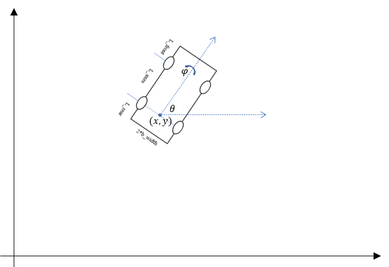

# MPC_path_planning-Demo
*A Quick Start Demo of MPC Path Planning Based on YALMIP in MATLAB*

Before using this code, we want you to have installed [Yalmip](https://yalmip.github.io/download/) and IPOPT solver.

vehicle's parameters:

[Chinese blog](https://zhuanlan.zhihu.com/p/652511722)

[Parallel Parking Demo](https://github.com/henryjchang/parallel-park/blob/master/parallel_park_simulation7.m) 
